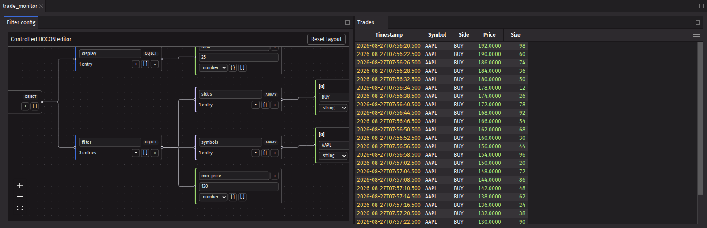
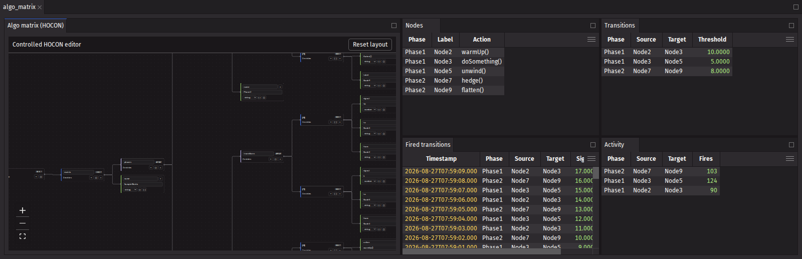
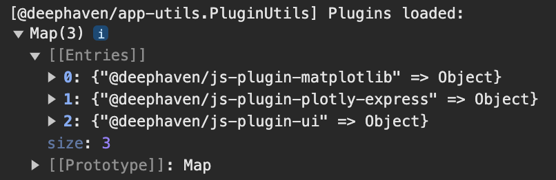
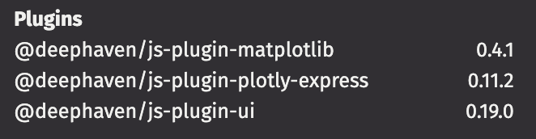

# deephaven_plugin_hocon

A Deephaven element plugin that edits HOCON configuration as an interactive node graph.

The `hocon_editor` component renders a configuration as a graph of nodes. Objects, arrays, and
scalar values each get a node, and the graph supports full structure editing: renaming keys,
adding and deleting entries, changing value types, and converting between objects, arrays, and
scalars. Every edit produces the updated configuration as a plain JSON-serializable dict.

HOCON is parsed on the Python side with [pyhocon](https://github.com/chimpler/pyhocon), so
substitutions and includes are resolved before the graph is built.

## Plugin Structure

The `src` directory contains the Python and JavaScript code for the plugin.  
Within the `src` directory, the deephaven_plugin_hocon directory contains the Python code, and the `js` directory contains the JavaScript code.

The Python files have the following structure:  
`hocon_editor.py` defines the `hocon_editor` component and normalizes dicts, `ConfigTree`
instances, and HOCON strings into plain JSON-serializable data.  
`register.py` registers the plugin with Deephaven. This file will not need to be modified for most plugins at the initial stages, but will need to be if the package is renamed or JavaScript files are moved.

The JavaScript files have the following structure:  
`DeephavenPluginHoconPlugin.ts` registers the plugin with Deephaven and maps the
`deephaven_plugin_hocon.hocon_editor` element name to the React view.  
`DeephavenPluginHoconView.tsx` renders the React Flow canvas and owns the controlled and
uncontrolled editing behavior.  
`hoconTree.ts` holds the immutable tree model and the path-based edit operations.  
`jsonToGraph.ts` derives the nodes and edges from the configuration and lays them out with dagre.  
`HoconNodes.tsx` defines the object, array, and value node components.  
`HoconEditorContext.ts` passes the edit callbacks down to the node components.

## Using plugin_builder.py

The `plugin_builder.py` script is the recommended way to build the plugin.
See [Building the Plugin](#building-the-plugin) for more information if you want to build the plugin manually instead.

To use `plugin_builder.py`, first set up your Python environment and install the required packages.  
To build the plugin, you will need `npm` and `python` installed, as well as the `build` package for Python.
`nvm` is also strongly recommended, and an `.nvmrc` file is included in the project.
The script uses `watchdog` and `deephaven-server` for `--watch` mode and `--server` mode, respectively.

```sh
cd deephaven_plugin_hocon
python -m venv .venv
source .venv/bin/activate
cd src/js
nvm install
npm install
cd ../..
pip install --upgrade -r requirements.txt
pip install deephaven-server watchdog
```

First, run an initial install of the plugin:
This builds and installs the full plugin, including the JavaScript code.

```sh
python plugin_builder.py --install --js
```

After this, more advanced options can be used.
For example, if only iterating on the plugins with no version bumps, use the `--reinstall` flag for faster builds.
This adds `--force-reinstall --no-deps` to the `pip install` command.

```sh
python plugin_builder.py --reinstall --js
```

If only the Python code has changed, the `--js` flag can be omitted.

```sh
python plugin_builder.py --reinstall
```

Additional especially useful flags are `--watch` and `--server`.
`--watch` will watch the Python and JavaScript files for changes and rebuild the plugin when they are modified.
`--server` will start the Deephaven server with the plugin installed.
Taken in combination with `--reinstall` and `--js`, this command will rebuild and restart the server when changes are made to the plugin.

```sh
python plugin_builder.py --reinstall --js --watch --server
```

If interested in passing args to the server, the `--server-arg` flag can be used as well
Check `deephaven server --help` for more information on the available arguments.

```sh
python plugin_builder.py --reinstall --js --watch --server --server-arg --port=9999
```

See [Using the Plugin](#using-the-plugin) for more information on how to use the plugin.

## Manually Building the Plugin

To build the plugin, you will need `npm` and `python` installed, as well as the `build` package for Python.
`nvm` is also strongly recommended, and an `.nvmrc` file is included in the project.
The python venv can be created and the recommended packages installed with the following commands:

```sh
cd deephaven_plugin_hocon
python -m venv .venv
source .venv/bin/activate
pip install --upgrade -r requirements.txt
```

Build the JavaScript plugin from the `src/js` directory:

```sh
cd src/js
nvm install
npm install
npm run build
```

Then, build the Python plugin from the top-level directory:

```sh
cd ../..
python -m build --wheel
```

The built wheel file will be located in the `dist` directory.

If you modify the JavaScript code, remove the `build` and `dist` directories before rebuilding the wheel:

```sh
rm -rf build dist
```

## Installing the Plugin

The plugin can be installed into a Deephaven instance with `pip install <wheel file>`.
The wheel file is stored in the `dist` directory after building the plugin.
Exactly how this is done will depend on how you are running Deephaven.
If using the venv created above, the plugin and server can be created with the following commands:

```sh
pip install deephaven-server
pip install dist/deephaven_plugin_hocon-0.0.1.dev0-py3-none-any.whl
deephaven server
```

See the [plug-in documentation](https://deephaven.io/core/docs/how-to-guides/use-plugins/) for more information.

## Using the Plugin

Once the Deephaven server is running, the plugin should be available to use.

The editor is uncontrolled when given a `default_value`. The client owns the configuration after
the initial render, and `on_change` is called with the updated dict after every edit.

```python
from deephaven_plugin_hocon import hocon_editor

editor = hocon_editor(
    default_value={"name": "prod", "port": 8080, "db": {"host": "localhost", "ssl": True}},
    on_change=print,
)
```

`value` and `default_value` also accept a HOCON string, which is parsed on the server. Invalid
HOCON raises, and substitutions and includes are resolved before the graph is built, so
`mirror.port` below is `9000`.

```python
editor = hocon_editor(default_value="app { port = 9000 }, mirror { port = ${app.port} }")
```

The editor is controlled when given a `value`. The server owns the configuration, and it is up to
the caller to update `value` in response to `on_change`. Passing both `value` and `default_value`
raises a `ValueError`.

```python
from deephaven import ui
from deephaven_plugin_hocon import hocon_editor


@ui.component
def config_editor():
    config, set_config = ui.use_state({"name": "prod", "port": 8080})
    return hocon_editor(value=config, on_change=set_config)


editor = config_editor()
```

Props are automatically converted from snake_case to camelCase, so `default_value` becomes
`defaultValue` and `on_change` becomes `onChange` on the JavaScript side.

### Examples

`examples/trade_filter.py` builds a dashboard where the config graph drives the filters on a live
ticking table. Run it in a Deephaven console and open the `trade_monitor` dashboard.



`examples/algo_matrix.py` edits an algo matrix: phases holding nodes and the transitions between
them. The graph feeds a nodes table, a transitions table, and a live feed of the transitions that
have fired, so changing a threshold or rewiring a node immediately changes the tables. Run it in a
Deephaven console and open the `algo_matrix` dashboard.



## Testing the Plugin

The end to end tests drive a real Deephaven server with the plugin installed and assert on the
configuration that reaches the server after each edit.

`tests/hocon_editor.spec.ts` covers the editing behavior: renaming keys, adding and deleting
entries, changing value types, converting between objects, arrays and scalars, and the difference
between a controlled and an uncontrolled editor.  
`tests/hocon_examples.spec.ts` runs the shipped examples and checks that editing the graph
re-filters and rebuilds the tables they derive.  
`tests/app.d` is loaded by the server in application mode, so every fixture is in the Panels menu
when the page loads.

Install the plugin first, then run the suite. Playwright starts the server itself, so the
virtual environment holding `deephaven-server` and the plugin must be active:

```sh
python plugin_builder.py --install --js
npm install
npx playwright install --with-deps chromium
npx playwright test
```

Set `DH_PORT` to run against a different port. To regenerate the images in this README:

```sh
UPDATE_SCREENSHOTS=1 npx playwright test tests/screenshots.spec.ts
```

## Debugging the Plugin

It's recommended to run through all the steps in [Using plugin_builder.py](#Using-plugin_builder.py) and [Using the Plugin](#Using-the-plugin) to ensure the plugin is working correctly.  
Then, make changes to the plugin and rebuild it to see the changes in action.
Checkout the [Deephaven plugins repo](https://github.com/deephaven/deephaven-plugins), which is where this template was generated from, for more examples and information.  
The `plugins` folder contains current plugins that are developed and maintained by Deephaven.  
Below are some common issues and how to resolve them as you develop your plugin.  
If there is an issue with the process while following the Installation and Usage steps on the originally generated plugin, please open an issue.

### The Panel is Not Appearing

#### Checking if the Plugin is Registered

If the panel is not appearing or an error is thrown that the import is not found, the plugin may not be registered correctly.
To verify the plugin is registered, check either the console logs or the versions in the settings panel.

- In the console logs, there should be a messaging saying `Plugins loaded:` with a map that includes this plugin.  
  

- To get to the settings panel, click on the gear icon in the top right corner of the Deephaven window. Towards the bottom this plugin should be listed.  
  
- If the plugin is not listed, attempt to rebuild and reinstall the plugin and check for errors during that process.

#### Checking if the Python Package is Installed

- Running `pip list` in the `.venv` environment should show the Python package installed, but this is not a guarantee that the plugin is registered properly.
- The version can also be checked directly from the Python console with:

```{python}
from importlib.metadata import version
print(version("deephaven_plugin_hocon"))
```

### The Panel is Appearing but with Errors or Not Functioning Correctly

Check both the Python and JavaScript logs for errors as either side could be causing the issue.

## Distributing the Plugin

To distribute the plugin, you can upload the wheel file to a package repository, such as [PyPI](https://pypi.org/).
The version of the plugin can be updated in the `setup.cfg` file.

There is a separate instance of PyPI for testing purposes.
Start by creating an account at [TestPyPI](https://test.pypi.org/account/register/).
Then, get an API token from [account management](https://test.pypi.org/manage/account/#api-tokens), setting the “Scope” to “Entire account”.

To upload to the test instance, use the following commands:

```sh
python -m pip install --upgrade twine
python -m twine upload --repository testpypi dist/*
```

Now, you can install the plugin from the test instance. The extra index is needed to find dependencies:

```sh
pip install --index-url https://test.pypi.org/simple/ --extra-index-url https://pypi.org/simple/ deephaven_plugin_hocon
```

For a production release, create an account at [PyPI](https://pypi.org/account/register/).
Then, get an API token from [account management](https://pypi.org/manage/account/#api-tokens), setting the “Scope” to “Entire account”.

To upload to the production instance, use the following commands.
Note that `--repository` is the production instance by default, so it can be omitted:

```sh
python -m pip install --upgrade twine
python -m twine upload dist/*
```

Now, you can install the plugin from the production instance:

```sh
pip install deephaven_plugin_hocon
```

See the [Python packaging documentation](https://packaging.python.org/en/latest/tutorials/packaging-projects/#uploading-the-distribution-archives) for more information.
